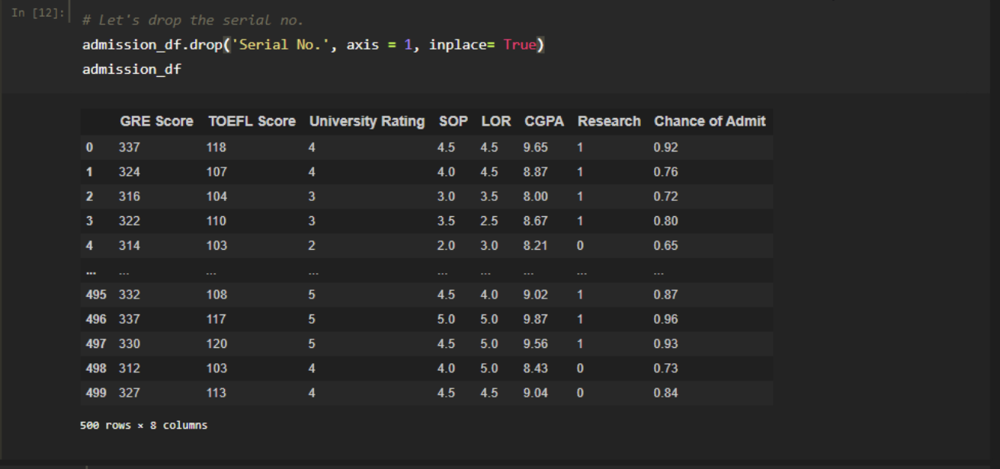
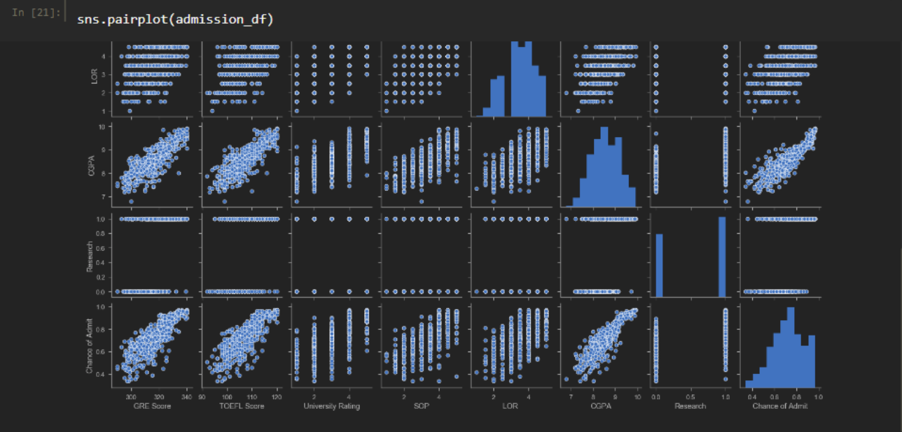
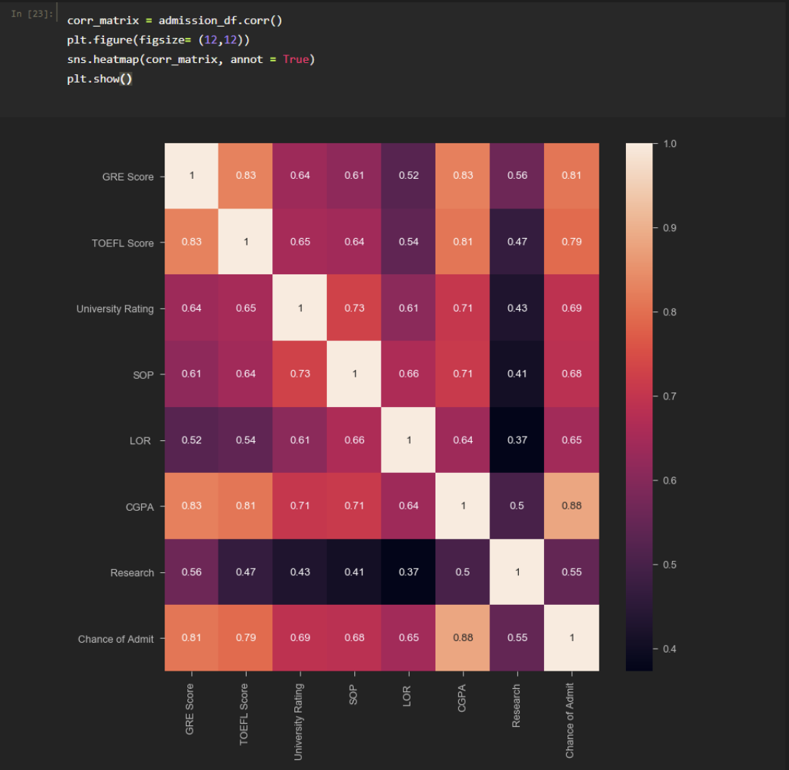
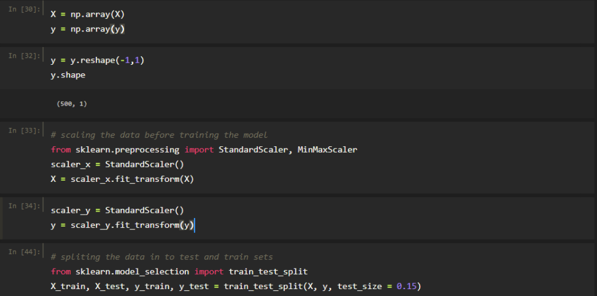
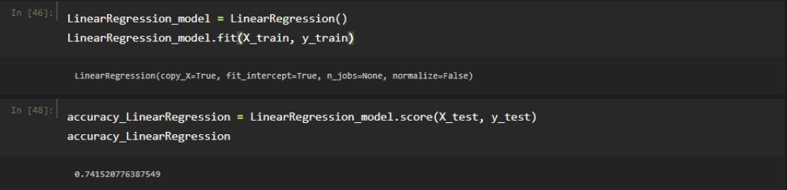
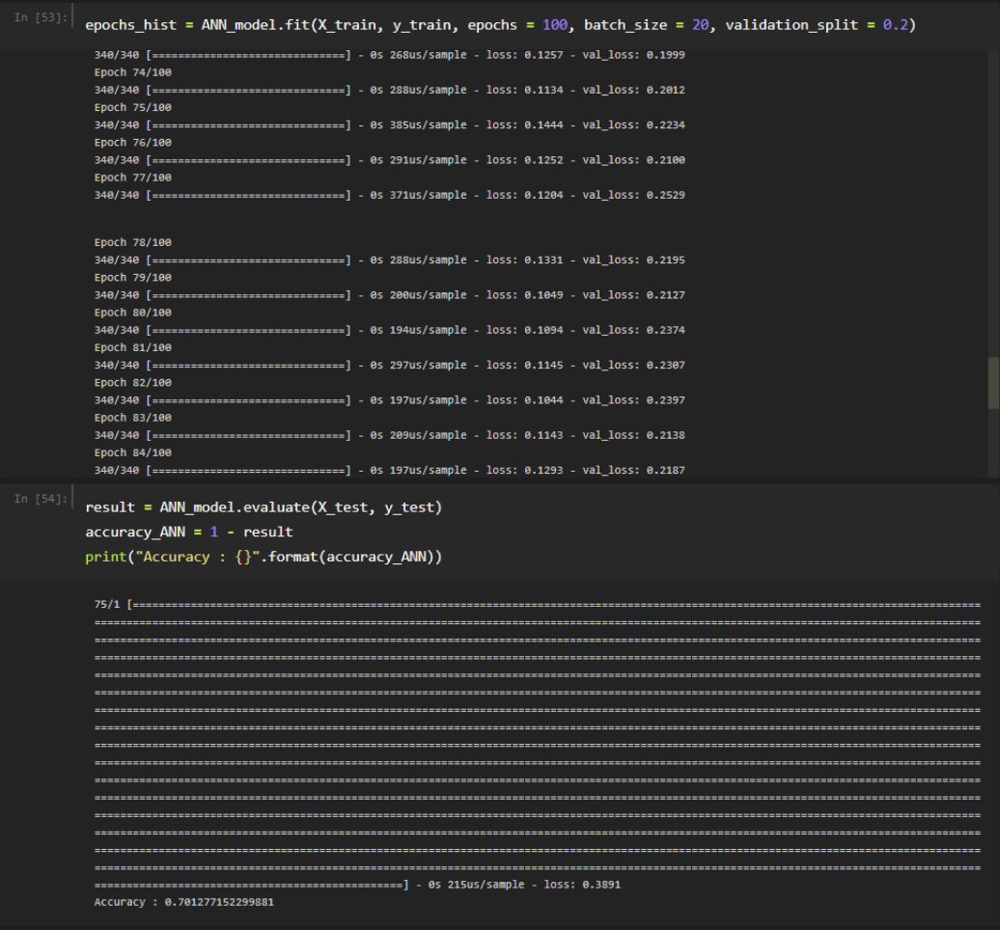

<!--
*** Thanks for checking out this README Template. If you have a suggestion that would
*** make this better, please fork the repo and create a pull request or simply open
*** an issue with the tag "enhancement".
*** Thanks again! Now go create something AMAZING! :D
-->

<!-- PROJECT SHIELDS -->
<!--
*** I'm using markdown "reference style" links for readability.
*** Reference links are enclosed in brackets [ ] instead of parentheses ( ).
*** See the bottom of this document for the declaration of the reference variables
*** for contributors-url, forks-url, etc. This is an optional, concise syntax you may use.
*** https://www.markdownguide.org/basic-syntax/#reference-style-links
-->
[![Contributors][contributors-shield]][contributors-url]
[![Forks][forks-shield]][forks-url]

[![LinkedIn][linkedin-shield]][linkedin-url]

  <h3 align="center">Predicting University Admissions using Linear Regression </h3>

<!-- TABLE OF CONTENTS -->
## Table of Contents

* [About the Project](#about-the-project)
* [Visualizing Data](#visualizing-data)
* [Create Training and Testing Datasets](#create-training-and-testing-datasets)
* [Train and Evaluate a Linear Regression Model](#train-and-evaluate-a-linear-regression-model)
* [Train and Evaluate an Artificial Neural Network Model](#train-and-evaluate-an-artificial-neural-network-model)
* [Train and Evaluate a Random Forest Regressor and Decision Tree Model](#train-and-evaluate-a-random-forest-regressor-and-decision-tree-model)
* [Contact](#contact)

<!-- ABOUT THE PROJECT -->
## About The Project

[![Product Name Screen Shot][product-screenshot]](https://example.com)

In this project I trained regression models to find the probability of a student getting accepted into a particular university based on their profile. This project could be practically used to get the university acceptance rate for individual students using web application.
I completed the following steps in order to reach the end goal (training a regression model):
 * Collect Relevant Data 
 * Visualize Data through graphs
 * Create Training and Testing Datasets
 * Train and Evaluate a Linear Regression Model
 * Train and Evaluate an Artificial Neural Network Model
 * Train and Evaluate a Random Forest Regressor and Decision Tree Model
 * Calculate and Print Regression model KPIs.

### Visualizing Data
The data collected has the following attributes:
* GRE Score
* TOEFL Score
* University Rating (Ranging between 0 and 5)
* SOP (Ranging between 0 and 5)
* LOR (Ranging between 0 and 5)
* CGPA (Rangin between 0 and 10)
* Research (0 or 1)
* Chance of Admit (Continuous Variable between 0 and 1)

Following is a summary of the data set:

We then create pairplot and a correlation matrix the data to get a better idea of what patterns we see in the data:

We see that average school rating our dataset is approximately 3 and GRE score is directly proportional to chance of admit.

<!-- GETTING STARTED -->
## Create Training and Testing Datasets

We divide the data set into two np arrays X and y.
* X: Independent variables (All variables except chance of admit)
* y: Dependent variable (chance of admit)

### Train and Evaluate a Linear Regression Model

Since we have multiple independent attributes/variables and our desired outcome is a number between 0 and 1,
we use multi-variable regression model. We get an accuracy of 74.15% from this model.

### Train and Evaluate an Artificial Neural Network Model

Results from the regression model were really promising but we try to find if we can get better results with
Artificial Neural Network model

We find that the artifical neural network gives us a lower accuracy as compared to linear regression.

<!-- USAGE EXAMPLES -->
## Train and Evaluate a Random Forest Regressor and Decision Tree Model

Moving forward, random forest regressor and decision tree models are created to evaluate difference in accuracy of
 different models.
 
 

As we can see both these models give us less accurate results as compared to linear regression. Therefore, we can
conclude that the regression model is the best one to use in our case.

<!-- CONTACT -->
## Contact

Muhammad Usama Ijaz - [mijaz18](https://www.linkedin.com/in/mijaz18/) - email@example.com

Project Link: [https://github.com/mijaz18/Predicting-University-Admissions-using-Linear-Regression](https://github.com/mijaz18/Predicting-University-Admissions-using-Linear-Regression)

<!-- MARKDOWN LINKS & IMAGES -->
<!-- https://www.markdownguide.org/basic-syntax/#reference-style-links -->
[contributors-shield]: https://img.shields.io/github/contributors/othneildrew/Best-README-Template.svg?style=flat-square
[contributors-url]: https://github.com/mijaz18/Predicting-University-Admissions-using-Linear-Regression/graphs/contributors
[forks-shield]: https://img.shields.io/github/forks/othneildrew/Best-README-Template.svg?style=flat-square
[forks-url]: https://github.com/mijaz18/Predicting-University-Admissions-using-Linear-Regression/network/members
[stars-shield]: https://img.shields.io/github/stars/othneildrew/Best-README-Template.svg?style=flat-square
[stars-url]: https://github.com/othneildrew/Best-README-Template/stargazers
[issues-shield]: https://img.shields.io/github/issues/othneildrew/Best-README-Template.svg?style=flat-square
[issues-url]: https://github.com/othneildrew/Best-README-Template/issues
[license-shield]: https://img.shields.io/github/license/othneildrew/Best-README-Template.svg?style=flat-square
[license-url]: https://github.com/othneildrew/Best-README-Template/blob/master/LICENSE.txt
[linkedin-shield]: https://img.shields.io/badge/-LinkedIn-black.svg?style=flat-square&logo=linkedin&colorB=555
[linkedin-url]: https://www.linkedin.com/in/mijaz18/
[product-screenshot]: images/logo.png